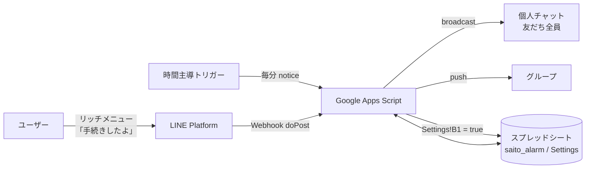

# 体育館予約リマインド LINE Bot

サークル幹部向けに、体育館の予約手続きを LINE 公式アカウントから自動でリマインドする Bot です。
予約が終わったら「手続きしたよ」ボタンを押すだけで通知が止まり、次の予約期間には自動で再開します。
サーバーを用意せず、Google Apps Script（GAS）だけで動きます。

## 作ったきっかけ

私は数百人規模のバレーボールサークルで幹部を務めており、体育館の予約やイベントの運営を担当しています。

幹部になりたての頃、体育館の予約手順を間違えてしまい、新入生を迎える大切な4月に体育館が予約できない事態を起こしました。
その月は、別の体育館での活動日を増やしたり、キャンセルが出ていないかを毎日何度も確認したりしました。その結果、例年よりむしろ多いくらいの活動日を確保できました。

ただ、個人の注意力に頼っていては同じことが起こりうると考え、予約の時期になると担当者に自動でリマインドを送る仕組みとして、この Bot を作りました。

## 主な機能

| 機能                               | 内容                                                                                                       |
| ---------------------------------- | ---------------------------------------------------------------------------------------------------------- |
| 定期リマインド                     | スプレッドシートに登録した日・時・分に、予約のリマインドを自動配信                                         |
| 個人チャット＋グループへの同時配信 | 幹部それぞれの個人チャットへ一斉配信し、幹部のグループにも送信                                             |
| ボタン1つで配信停止                | 予約が終わったら、個人チャットのリッチメニュー「手続き完了」を押すだけで、個人・グループどちらの配信も停止 |
| 次の予約期間に自動再開             | 停止した通知は、次の予約期間に向けて自動的に再開（「キャンセル」と送れば手動でも再開可能）                 |
| ノーコードで配信設定               | 配信内容・タイミングはスプレッドシートを編集するだけで変更可能                                             |

## 仕組み



1. 時間主導トリガーで `notice()` が定期実行され、シートの配信予定と現在時刻を照合します。
2. 該当する行があれば、Messaging API の broadcast で個人チャットへ、push でグループへ送信します。
3. ユーザーが「手続きしたよ」と送ると、Webhook（`doPost`）が受け取り、`Settings!B1` を `true` にして配信を停止します。
4. 送信の直前に毎回 `Settings!B1` を確認するため、配信処理の途中で停止されても、それ以降は送りません。

## 使用技術

- **Google Apps Script**（V8 ランタイム）：サーバーレスでの定期実行と Webhook の受信
- **LINE Messaging API**：reply / push / broadcast
- **Google スプレッドシート**：配信スケジュールと配信状態の管理
- **clasp**：GAS をローカルで開発し、Git / GitHub でバージョン管理

## 工夫した点・学んだこと

- **通知が「うるさくない」設計**
  予約が終わったあとも、予約可能期間中に毎日通知が届くのは煩わしく、通知そのものが無視されるようになってしまいます。そこで、完了ボタンで通知を止め、次の予約期間に自動で再開する `autoResumeNotification()` を用意しました。「必要なときだけ届く」状態を保つことで、リマインドが確実に読まれるようにしています。
- **認証情報をコードから分離**
  もともとは個人用だったため、チャネルアクセストークンをコードに直接書いていました。GitHub で公開するにあたって、GAS のスクリプトプロパティから読み込む形に変更し、秘密情報がリポジトリに含まれないようにしました。
- **停止の確実性**
  停止フラグを配信処理の最初に1回だけ確認するのではなく、個人チャット・グループそれぞれの送信直前に確認するようにしました。停止ボタンが押された直後に余計な通知が届かないようにするためです。
- **想定外のイベントへの対応**
  Webhook の検証リクエスト（イベントが空）や、スタンプ・友だち追加などテキスト以外のイベントで処理が落ちないようにしました。1回のリクエストに複数のイベントが含まれる場合にも対応しています。
- **失敗に気づける作り**
  LINE API の応答コードを確認し、失敗時にはログを残すようにしました。トークン切れや通数上限にすぐ気づけます。
- **重複コードの共通化**
  reply / push / broadcast の送信処理を `callLineApi()` にまとめ、エラー処理を1か所で管理できるようにしました。

## スプレッドシートの構成

**`saito_alarm` シート**（1行目は見出し）

| A: 日 | B: 時 | C: 分 | D: メッセージ                | E: 宛先                            |
| ----- | ----- | ----- | ---------------------------- | ---------------------------------- |
| 25    | 21    | 0     | 体育館の予約をお願いします！ | グループID（空欄なら一斉配信のみ） |

日・時・分を空欄にした項目は「毎日」「毎時」「毎分」として扱います。

**`Settings` シート**

| セル | 内容                    |
| ---- | ----------------------- |
| B1   | `TRUE` のとき配信停止中 |

## セットアップ

1. LINE Developers で Messaging API チャネルを作成し、チャネルアクセストークン（長期）を発行する
2. GAS の「プロジェクトの設定」→「スクリプト プロパティ」に `LINE_ACCESS_TOKEN` を登録する
3. `SHEET_KEY` を使用するスプレッドシートの ID に書き換える
4. clasp でコードを反映する
   ```bash
   clasp push
   ```
5. ウェブアプリとしてデプロイし、発行された URL を LINE の Webhook URL に設定する
6. トリガーを設定する
   - `notice`：時間主導型・1分ごと
   - `autoResumeNotification`：時間主導型・次の予約受付が始まる前に実行（停止中の通知を自動で再開）

## 今後の改善予定

- GAS のトリガーは実行時刻が数十秒〜数分ずれることがあるため、「前回実行時刻以降に予定された配信」を送る方式に変え、送り漏れを防ぐ
- 誰が手続きを完了したかを記録し、未完了の人にだけリマインドする

## ライセンス

[MIT License](LICENSE)
